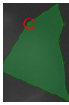

# labelimage

<<<<<<< HEAD
- [labelimage](#labelimage)
	- [前言](#前言)
	- [1 功能列表](#1-功能列表)
		- [1.1 目标检测](#11-目标检测)
			- [1.1.1 目标检测功能](#111-目标检测功能)
			- [1.1.2 标注流程](#112-标注流程)
			- [1.1.3 编辑标注框](#113-编辑标注框)
			- [1.1.4 标注区视图调整](#114-标注区视图调整)
			- [1.1.5 保存和输出](#115-保存和输出)
		- [1.2 分割标注模块](#12-分割标注模块)
			- [1.2.1 语义分割标注主界面](#121-语义分割标注主界面)
			- [1.2.2 分割标注流程](#122-分割标注流程)
			- [1.2.3  编辑标注框](#123--编辑标注框)
			- [1.2.4 标注框的调整](#124-标注框的调整)
			- [1.2.5 保存和输出](#125-保存和输出)
		- [1.3 OCR标注模块](#13-ocr标注模块)
		- [1.4 分类标注模块](#14-分类标注模块)
=======
！[toc]

>>>>>>> 6b36cde25c509b38410001a2553fc5bf3cc15a90
## 前言

本人开发的一个深度学习标注工具，满足了常见的深度学习的标注任务，主要包括如下的内容：

1. 分类任务
2. 目标检测
3. OCR
4. 语义分割

整个内容如下图所示：

具体操作演示如下的视频(请忽略水印)：

## 1 功能列表

该工具能满足目前大部分的深度学习标注任务，包括目标检测、语义分割、OCR以及分类。该软件主要分为这四个功能模块。

### 1.1 目标检测

#### 1.1.1 目标检测功能

目标检测标注模块，包含了目前所有目标检测的标注要求。包括常见的**YOLO**系列，**SSD**系列以及**RCNN**系列。所以标注既可输出YOLO的标注格式也可以输出VOC的标注方式。其中检测模块的主界面如下:

软件主要分为功能区、图片信息区、标注区和标注信息区四个主要的模块。其中功能区主要包括的功能列表如下:

1. 返回主页

2. 打开待标注的文件

3. 选择标签文件

4. 标签文件选择框

5. 检测标注功能选项

6. 撤销操作

7. 重做操作

8. 复制

9. 裁剪

10. 删除

11. 粘贴

12. 移动图片

13. 全屏标注

14. 图片实际尺寸选项

15. 适应窗口标注

16. 上一张和下一张

其中标注模块有上述的16项功能，可以说本软件功能十分强大。相比同类的标注软件，可以说功能十分强大。

#### 1.1.2 标注流程

标注的流程分为如下的几个步骤：选择标注类型、打开标注标签文件、打开待标注文件、 图片和保存图片。 

本软件在设计之初为了统一规范标注，采用的是首先定义后选择的模式而不是标注过程 填写标签类型。打开本软件的文件夹选项 首先选择的是标签文件，统一要求标签文件 以”.names”作为后缀名，其它后缀名的文件则不支持。选择标签文件后然后选择待标注图片 文件后即可进行标注。 

当选择标注功能选项后这里可以分为两种标注：先标注后选择标签和先选择标签后标注。 第一种标注模式是先在图片的相应位置标注好信息并选中当前的标注框然后从标签下拉框 中选择相应的标签。第二种模式则是再不选择任何已有标注框的情形下选择好标签类型后在 进行标注。同时为了更好的查看标注的结果，在每个标注框的左上角的位置显示出标注的标签类型效果如下图所示：

#### 1.1.3 编辑标注框

当完成一个标注框后可以选择对标注框进行编辑包括标签的修改以及位置的修改。当再 次点击标注功能框后则由标注模式转换为了标注模式。当鼠标经过标注框并单击后标注框则 出现了如下的状态：

鼠标放到标注框上后呈现 形状，并且在标注框的四个角点出现了红色的正方形块后。 这时可以选中标签下拉框对标签进行修改也可以对标注的位置进行移动和调整，这里的调整 包括标注框的整体移动和位置的微调。可以在标注框中的位置拖动整个标注框也可以选择在 四个角点处对标注框进行调整。也可以选择删除该标注框。同时每一步的操作后都会有”redo” 和”undo”的记录可以选择撤销和重做操作。这里的功能区也提供了复制一个标注框的功能， 我们可以选择将整个标注进行复制并移动到相应的标注位置上而不是重新标注。

#### 1.1.4 标注区视图调整

为了提高标注的体验和效率，本软件提供了标注区视图调整的功能。主要分为图片的移动功能、 图片适应窗口、图片的实际大小以及全屏标注功能选项。针对待标注区域较小的情况可以选 择全屏和鼠标滚轮放大进行标注。

#### 1.1.5 保存和输出

本软件采用了自动保存标注信息的模式，用户在标注完成后无需手动的选择保存文件。 标注完成后当用户选择下一张后上一张后，图片的标注信息便会自动保存。按照目前的需求检测标注完成后则会有三部分内容输出：标签文件、标注的图片和标注信息。标注完成后的图片将会和标注信息放到同一个文件夹中。标注信息会以标注图片的名称+“.txt”进行保存。其中导出的YOLO格式标注文件为已标注的图片和其对应的标注好的”txt”文件。其中”txt”文件为使用 工具标注的结果，格式为(label x y w h)的格式，例如：

4 0.324233 0.814479 0.037619 0.202155

内容主要分为五个部分，分别用空格分隔。如果图片中目标不止一个，则会有多行标注 信息，每一行代表该图片中一种类别目标的位置信息。这里可以更清晰的用表格来表示：

| **Label** | x        | y        | w        | h        |
| --------- | -------- | -------- | -------- | -------- |
| 4         | 0.324233 | 0.814479 | 0.037619 | 0.202155 |

label顾名思义就为该目标的类别编号，如编号为”4”则表示为对应标签文件的第五个 类别的目标。x 和 y 表示的是能包含目标最小矩形框的中心点归一化后的坐标，该坐标是根 据中心点的实际坐标相对于整个图像归一化计算得到的。这个都是约定俗称的计算规则，这 里就不在赘述了。w 和 h 则表示的是目标的宽和高同样是相对于整个图像归一化后的结果。

### 1.2 分割标注模块

#### 1.2.1 语义分割标注主界面

​      分割标注模块相对于检测标注模块整体流程大致相同，但分割模块相对于检测模块较为 复杂。分割标注模块的主界面如下图所示:

分割标注模块相较于检测标注模块唯一不同的就是功能区，分割标注模块针对这部分需求对功能进行了适当的调整。如增加了导出语义图的模块。

#### 1.2.2 分割标注流程

分割标注的流程和检测标注的大致流程类似，也是先分别选择标签文件和待标注图片。 二者的主要区别在于标注的方式。检测标注为矩形框标注而分割标注则为像素级别的标注将 图片中该类别的像素都标记出来，所以分割标注的工作量明显高于检测标注。 

这里主要强调一下标注过程的一些操作说明：在描点标注过程中采用的鼠标单击描点的 形式，要在目标的轮廓边缘进行描点。要求最终的轮廓能很好的贴合住目标，最终形成一个 封闭的空间。本软件在设计之初要考虑到这点提供了很多便捷的操作。如当描的点足以形成 一个封闭的空间时，当最终点靠近起始点时则会进行放大处理。这时候只要在该处单击即可 完成标注。效果如下图所示：

#### 1.2.3  编辑标注框

与检测标注类似，本软件也提供了对现有的标注框的编辑，包括修改标签、调整位置和 删除等功能。操作方式也和检测标注类似当再次点击多边形标记按钮后，当切换到编辑模式。 当鼠标经过相应的标注框时则会用绿色掩膜突出显示，当在要编辑的标注框处单击时则该标注框则转换为编辑模式。同时，此时鼠标也变成了手掌模式，各个坐标点也都变成了正方形 形态。当鼠标经过已有坐标点附近时则鼠标形态变为手指指向的模式提示可以对其进行调整， 这时就可以对该标注框进行标签以及位置的调整。具体如下图红色所示：

#### 1.2.4 标注框的调整

相较于检测标注模块，标注区域视图的调整对语义分割标注模块就显得至关重要了。因为语义分割标注模块是针对像素级别的标注，需要更细粒度的标注。关于这个模块的使用可以参考检测标注文档中该功能模块。

#### 1.2.5 保存和输出

分割标注模块最终要输出标注图片和其对应的语义图，同时为了方便缺陷库的管理。这 里要输出每张图片的标注信息的”json”文件。正如前面所讲的分割的标注工作量明显的高于 检测标注的工作量，而且分割标注是更大粒度的标注。所以，在分割输出的同时也会输出相 应的”YOLO”标注格式。以达到一次标注生成两份训练数据的目的，生成的分割标注结果和YOLO格式标注效果如下图所示：

当标注完成后可以点击生成语义图按钮 ，生成已经标注好的图片，最终生成的语义图如下图所示：

语义图中会针对不同类别以不同的颜色深浅进行显示，这样就完成了整个分割的标注。

分割标注主要完成了描点标注功能，分割标注目前输出的标注文件分为三部分： 分割标注信息的”json”文件、目标对应标注信息的”txt”文件和目标语义图。 其中标注信息”json”文件主要记录了图片的信息以及目标在图像中的轮廓点的坐标信息。 其中的键值对信息如下：

{ 

​	"version": "4.5.5", 

​	"flags": {},

​	"shapes": [

​    { 

​		"label": "", 

​		"points": [

​		 [

​		 ] 

​		"group_id": null, 、

​		"shape_type": "",

​		 "flags": {}

 	}, 

​	"imagePath": "",

​	"imageHeight": “”, 

​	"imageWidth": “”,

​	 "imageData": "", 

}

其中 shapes 键中记录了各个目标轮廓点在图片上的坐标点信息。当有多个目标时，就 这些目标点信息加入到”shape”键中。该“json”文件各个键的说明如下表：

 正如上文提到的，分割的标注工作量要明显高于检测标注的。所以，综合分割和检测的 特点，本工具做到了”一次标注，多次导出”的功能，就是在导出图片的分割标注信息的同时， 也会导出对应的检测标注信息。检测标注目前导出为”yolo”格式。同时，当完成一个图片标注时，可以选择直接生成语义图到指定文件夹。最终输出图片对应的语义图信息。语义图信息，前文中也有介绍这里也不在概述了。

### 1.3 OCR标注模块

OCR标注模块主要是为OCR识别部分的模型提供标注数据，该标注模块的主要界面如下图所示：

该标注界面和语义分割标注的界面类似，不同的是OCR不在选择标签文件而是通过人工去标注图片的标签。如上图的标签区域表示，完成标注后则会保存文本区域的角点坐标信息和标签内容。该过程的具体标注过程和语义分割标注类似，具体操作可以参照第3部分的标注过程。标注完成后最终标注结果保存格式如下：

OCR标注文件的输出文件为图片中文本区域的点坐标以及标签信息，其中标注信息如下：

**281.487860 301.000000 337.222457 288.000000 337.222457 312.000000 279.798933 323.000000** **粤F88888**

​     标注信息每行记录了一行文本的具体点坐标信息和label标签信息，坐标信息和label信息用空格分开。软件最后会根据标注的信息生成透视矫正的文本图片信息，会保存为标签名作为文件名的文件。

### 1.4 分类标注模块

分类标注模块相较于其它其它三个模块而言相对简单，这里的功能也最简单。因为，分类只是对图片做一下分类，只需对每个图片选择相应的标签即可，该模块的主要界面如下：

功能区的功能也相对简单，选择一张图片然后选择对应的标签即可。分类标注的输出就相对简单了，分类标注最终会输出以文件名+”_class.txt”的标注信息。标注信息内容则为该图片的具体类别。

<b>Image Labeler 3.1.2</b> is based on Qt 5.12.3 and FreeImage 3.18.

Press <b>Right Mouse Button</b> on selected box to change target type. 
<b>Ctrl + D:</b> Draw Box 
<b>Delete Key:</b> Delete Selected Box 
<b>Ctrl + A:</b> Select All Boxes 
<b>Up/Down Arrow Key:</b> Switch images

